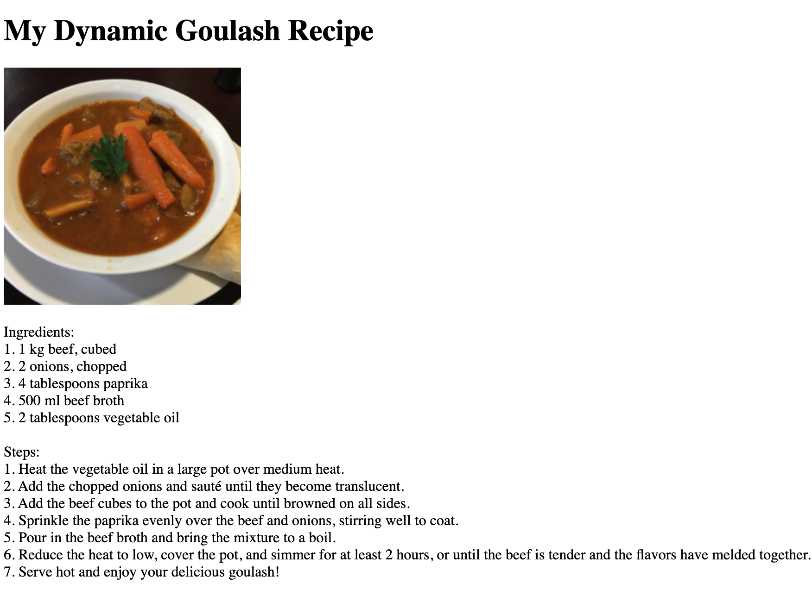

# tailgate

Tailgate makes it easy to add generative-AI components to static websites or client-facing web apps. You can use it to create highly custom, engaging AI features for your site visitors.

### Basic Usage

Import the javascript library (we'll host a CDN soon):

```
<script src="../tailgate.js"></script>
```

Decorate HTML tags with the `data-gentag` and `data-prompt` tags. For example:

```

<p id="recipe" data-gentag data-prompt="Craft a recipe for goulash using exactly five ingredients. Return the ingredients to make it, and the steps to do so, and nothing else."></p>
```

and instantiate the library:

```
<script>new tailgate('example-public-key');</script>
```

et violà! Your components will hydrate with AI-generated content:



See the `recipe-generator.html` for a full implementation.

### Setup

For now, tailgate is a self-hosted, experimental project. **If you want help setting it up or would like to use an externally managed version, email [seth.kimmel3@gmail.com](mailto:seth.kimmel3@gmail.com)**. 

1. Tailgate uses [Modal](https://modal.com/) on the backend and [OpenAI](https://openai.com/) for inference - you'll need accounts with both. Once created, use Modal's built-in secrets manager to  store your OpenAI API key.

2. Once you've done so, open up `configs.py` and modify `DOMAIN_WHITELIST`. Create an arbitrarily-named public API key, and whitelist the domains where you'll be integrating tailgate. For example: 

    `'example-public-key': ['localhost', 'sethkim.me']`

3. At this point, you can deploy the server to Modal using `modal deploy server.py`. It will respond with a public URL route that you'll use to replace the default URL route in `tailgate.js`, like so: 

    `this.base_url = "https://[your-modal-username]--tailgate-api-app.modal.run";`

You should now be able to hit your own self-hosted API endpoints from the `tailgate.js` client installed on your website.

### Advanced Usage

`tailgate.js` exposes a client API, allowing you to do far more powerful things than just static generation. There are currently methods that allow for generation of text and images, as well as answering questions over custom data.

#### Accessing the API

Simply instantiate the tailgate library as an object:

`var TG = new tailgate('example-public-key');`

and use that object to access the libraries methods, like so:

```
TG.ask_docs(document.getElementById('question').value, function(answer) {
    // do something with the answer
});
```

For a custom example that uses both image and text, check out the `meal-idea.html` example.

#### Using Custom Data

To add your own data that users can ask questions about, copy files to the `documents` directory adjacent to `server.py` (removing the example documents first). Currently we only support PDF's, but will add more file types based on demand.

To view an example that uses custom data, check out the `menus-qa.html` example. 

### Warning!

This is an experimental repo, and there are always malicious actors. To mitigate risk, it's recommended to set a low "hard limit" in the your OpenAI account in case of fraudulent usage. We'll likely be adding additional fraud prevention features soon. 